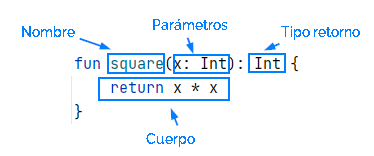

El concepto de función de programación es muy parejo al de función matemática, aunque hay matices.

Ya utilizamos funciones en nuestros ejemplos, por ejemplo *print()*. Pero no sólo usamos funciones ya hechas, también  escribimos el código de una función, concretamente escribimos constantemente el código de la  funcion "especial" *main()* que será una función que llama o invoca el sistema Kotlin para comenzar la ejecución de nuestra  aplicación. 

Una función es un bloque de código que se escribe para realizar una tarea en particular. Se escribe una vez y luego se puede utilizar o llamar las veces que queramos por lo tanto es uno de los mecanismos que tienen los lenguajes de programación para evitar duplicar código.

el funcionamiento básico de una función es:
 1. recibe una entrada por sus parámetros
 2. ejecuta las instrucciones de su cuerpo que probablemente utilicen los valores recibidos por los parámetros
 3. y finalmente como resultado de su ejecución devolverán casi siempre un valor de retorno.

## sintaxis

El siguiente ejemplo muestra la sintaxis de declaración de una función en Kotlin:
```
fun square(x: Int): Int {
    return x * x
}
```
El cometido de función anterior es elevar al cuadrado un valor entero.



Comenzamos con la palabra reservada *fun* y a continuación: 
- Nombre de la función − Es el nombre que eliges para la función con el fin de esclarecer su propósito
- Lista de parámetros − Datos de entrada para la función. Defínelos como nombre:tipo y sepáralos por comas.
- Tipo de retorno − Tipo de dato de salida de la función. Una función con un cuerpo de bloque de código, siempre debe tener su tipo definido.
- Cuerpo de la función – Son todas las sentencias que realizan la tarea para llegar al resultado final de retorno. Usa la expresión return para devolver el valor.

## Llamar a una función
LLamar o invocar a una función consiste simplemente en  escribir su nombre junto a los valores que queremos que tomen sus parámetros.  A los valores que le pasamos a la función le llamamos *argumentos*, 
```
fun square(x: Int): Int {
    return x * x
}

fun main() {
    println(square(2))
    println(square(5))
}
```

## Funciones Con Cuerpo De Expresión
También se les conoce por *funciones de una sóla línea*.

Si el cuerpo de una función es tan sencillo que consiste en devolver simplemente el valor de una expresión podemos escribir la función con una sintaxis más breve. Volvemos a escribir la función square() con esta sintaxis y observamos:
- se escribe en una única línea
- desaparecen  {} y return.
- aparece =
```
fun square(x: Int): Int =  x * x

fun main() {
    println(square(2))
    println(square(5))
}
```


## Retorno Tipo Unit
Toda función tiene que tener un tipo de retorno. Si una función no devuelve ningún valor debe especificarse con elun tipo de retorno especial *Unit*. 
```
fun saludar(nombre: String): Unit {
    println("Hola, " + nombre)
}
fun main() {
   saludar("Winchi")
}
```
La función main() tiene como tipo de retorno Unit y por tanto puedes deducir que si en la definición de la función omitimos el tipo de retorno se asume que su tipo es *unit*.

```
fun saludar(nombre: String){
    println("Hola, " + nombre)
}
fun main() {
   saludar("Winchi")
}
```
## Parametros con valores por defecto
Al definir la función es posible indicar los valores por defecto de los parámetros. Por el momento para simplificar, nos fijamos en el funcionamiento de este mecanismo cuando la función consta de sólo un parámetro.
```
fun saludar(nombre: String="Churry"){
    println("Hola, " + nombre)
}
fun main() {
    saludar("Winchi")
    saludar()
}
```
## ¿Porqué usar funciones?
La incorporación de las funciones en la programación fue un gran avance, algunas razones al respecto de la importancia de las funciones:
- Se pueden ejecutar más de una vez en un programa y/o en diferentes programas ahorrando tiempo de programación.
- Es una forma de compartir código entre programadores.
- Es una forma de dividir un problema complejo en problemas simples. cada problema simple sería una función. Esto además facilita la división de tareas entre un equipo de programadores.
- Mejora la estructura y legibilidad de un programa.
- Se pueden probar individualmente y por tanto facilita el mantenimiento del programa.
- son la base del paradigma  de programación funcional  que veremos más adelante en el curso.
- 


