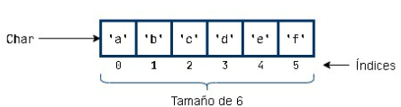

# Arrays
Un array es un conjunto de valores del mismo tipo y permite acceder a ellos a través de una sola variable. Por ejemplo si tengo que almacenar 100 números enteros en lugar de crear 100 variables individuales puedo gestionar esos 100 valores enteros de forma simple y uniforme con un array de enteros a través de una única variable.

Otras cuestiones que caracterizan a un array son:
-  es una estructura de tamaño fijo, una vez que se crea no se puede modifica su tamaño.
-  sus elementos se almacenan de forma contigua.
-  a cada elemento se le asocia un índice correspondiente a su posición teniendo en cuenta que la primera posición se corresponde con el índice 0.

Por ejemplo, esto sería la visión gráfica de un array de 6 elementos de tipo Char


La potencia de objetos como el array se entenderá cuando estudiemos estructuras de control. Vemos en este documentos sólo algunas de las cuestiones básicas del manejo de arrays

## Crear un Array 
Hay varias formas de crear una array, para simplificar,  por el momento nos limitamos a crear un array de dos formas:
- con  arrayOf()
- con arrayOfNulls() 

### Crear un array con arrayOf()
Simplemente separamos por comas una lista de los elementos que va a almacenar el array. Recuerda que todos los elementos tienen que ser del mismo tipo.  El tamaño del array se deduce automáticamente del tamaño de la lista indicada.

```
val nombres= arrayOf("yo","tú","el")
val impares= arrayOf(1,3,5)
```
### Crear una array con arrayOfNulls()
 Puede ocurrir que al principio del programa no sepamos los valores del array ya que por ejemplo se quieren introducir los valores por teclado, en este caso, podemos crear el array de forma que contenga sus elementos inicializados al valor null. Basta en este caso simplemente indicar el tamaño deseado y el tipo de los elementos. 
 ```
  val impares= arrayOfNulls<Int>(3)
 ```

## Tamaño de un array
Ya indicamos que el tamaño o longitud del array se determina en el momento de su creación.Podemos consultar el tamaño de un array a través de la propiedad *size*
```
fun main() {
    val nombres= arrayOf("yo","tú","el")
    val impares= arrayOf(1,3,5,7)
    println("tamaño de array nombres:" + nombres.size)
    println("tamaño de array impares:" + impares.size)
}
```
## Acceder a un elemento del array

Los arrays son accesibles con un sistema de índices similar al que vimos con los Strings de forma que  el primer elemento se corresponde con el índice  0, el segundo con el 1, etc.  Al igual que con los Strings el acceso a los elementos del array se realiza indicando el índice entre corchetes.
Por ejemplo, comprobamos que efectivamente con arrayOfNulls inicializamos a Null y a continuación cambiamos de valor los elementos del array

```
fun main() {
    val impares= arrayOfNulls<Int>(3)
    println(impares[0])
    println(impares[1])
    println(impares[2])

    impares[0]=55
    impares[1]=99
    impares[2]=33

    println(impares[0])
    println(impares[1])
    println(impares[2])

}
```
# Listas

Una lista, de forma simplificada, es una evolución mejorada de un array. 
La característica más básica de un array es su acceso por posición a cada elemento individual a traves de [] y esta característica también es posible trabajando con listas como  vemos en el siguiente ejemplo 
```
fun main() {
    //val miLista: List<Int> = listOf(1, 2, 3)//el tipo en este caso lo puede inferir el compilador
    val miLista = listOf(1, 2, 3)
    println("imprimir toda la lista junta $miLista") // [1, 2, 3]
    println("imprimir la lista elemento a elemento ")
    println(miLista[0])
    println(miLista[1])
    println(miLista[2])
    println("el tamaño de la lista es:  "+ miLista.size)
}

```
## Algunas diferencias importantes entre listas y arrays
  Hay dos tipos básicos de listas:
  - inmutables
  - mutables. Permiten modificar el valor de sus elementos así como añadir/borrar  elementos a la lista, es decir, modificar el tamaño de la lista.
  
Un array es una mezcla de los comportamientos anteriores. Su tamaño se fija en el momento de su creación y no se puede cambiar pero cada elemento individual puede cambiar en cualquier momento. 

## Ejemplo de lista mutable
Hay varias formas de crear una lista mutable, Vemos un ejemplo con *mutableListOf()*
```
fun main() {
    val colorsList = mutableListOf("Amarillo", "Azul", "Rojo")

    colorsList.add("Verde") // [Amarillo, Azul, Rojo, Verde] //inserta al final
    colorsList.add(0, "Blanco") // [Blanco, Amarillo, Azul, Rojo, Verde]//inserta en la posición indicada indicada
    colorsList.removeAt(2) // [Blanco, Amarillo, Rojo, Verde]
    //observa como modificamos con []
    colorsList[1] = "Negro" // [Blanco, Negro, Rojo, Verde]
    println(colorsList) // [Verde, Rojo, Negro, Blanco]
}
```

## Listas vs Arrays 
Se prefieren las listas. Las listas  tienen características actualizadas de seguridad  y permiten una programación más cómoda y legible. Entonces, ¿porqué existen arrays en kotlin?
- Los arrays pueden ser más eficientes. los arrays  garantizan un almacenamiento de los datos de forma contigua en memoria. Esto los hace más eficientes pero hoy en día esto sólo tiene impacto en aplicaciones muy concretas.
- Kotlin es compatible con Java. En java los arrays son muy importantes.


## La funcion split() de los Strings
split() permite trocear o dividir un String en trocitos más pequeños y estos trozos los devuelve en un lista. Como parámetro se le indica el criterio de división o delimitador. 
Por ejemplo el delimitador en el siguiente ejemplo es el String ":"

```
fun main() {
    val str = "A:B:C:que bonito:z zz"
    val delim = ":"

    val list = str.split(delim)

    println(list)    // [A, B, C, que bonito, z zz]
}
```
El delimitador realmente es una expresión regular pero de momento con pensar que es  un caracter no es suficiente. 

Uno de los usos más frecuentes es querer dividir un texto en palabras utilizando como delimitador el el espacio en blanco.

```
fun main() {
    val str = "Había una vez un circo que alegraba siempre la ilusión"
    val delim = " "

    val list = str.split(delim)

    println(list)    // [Había, una, vez, un, circo, que, alegraba, siempre, la, ilusión]
}
```
Utilizaremos split() para com combinar con el readln() para entrada de datos por teclado que veremos más adelante.
## Asignaciones entre variables Lista

Se explica este concepto con variables tipo lista pero es igualmente aplicable a variables tipo array.

Una variable Lista  no almacena directamente los datos de la lista si no que almacena la dirección de memoria donde están almacenados los datos
```
fun main() {
    var a = mutableListOf(0,2,4,6,8)
    var b = mutableListOf(1,3,5,7,9)
    println(a)
    println(b)
}
```
La situación en memoría podemos imaginarla como:


Observa ahora la aparición de una nueva variable c
```
fun main() {
    var a = mutableListOf(0,2,4,6,8)
    var b = mutableListOf(1,3,5,7,9)

    var c =a
    a=b

    println(a)
    println(b)
    println(c)
}
```
La situación en memoría podemos imaginarla como:


Conclusión:  Una asignación entre variables lista no provoca que se copie la lista, si no que la variable de la izquierda también referencia a la misma lista que la variable de la derecha. 
