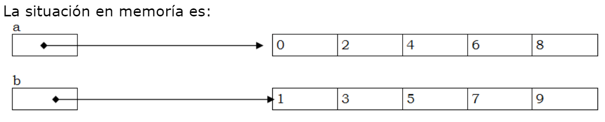
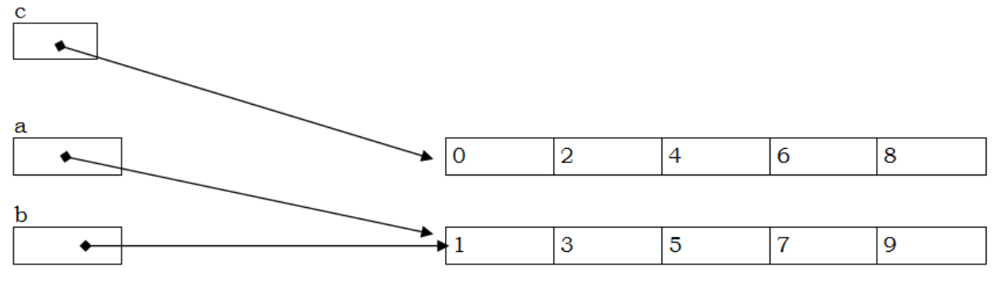

Una lista, de forma simplificada, es una evolución mejorada de un array. 
La característica más básica de un array es su acceso por posición a cada elemento individual a traves de [] y esta característica también es posible trabajando con listas como  vemos en el siguiente ejemplo 
```java
fun main() {
    //val miLista: List<Int> = listOf(1, 2, 3)//el tipo en este caso lo puede inferir el compilador
    val miLista = listOf(1, 2, 3)
    println("imprimir toda la lista junta $miLista") // [1, 2, 3]
    println("imprimir la lista elemento a elemento ")
    println(miLista[0])
    println(miLista[1])
    println(miLista[2])
    println("el tamaño de la lista es:  "+ miLista.size)
}

```
## Algunas diferencias importantes entre listas y arrays
  Hay dos tipos básicos de listas:
  - inmutables
  - mutables. Permiten modificar el valor de sus elementos así como añadir/borrar  elementos a la lista, es decir, modificar el tamaño de la lista.
  
Un array es una mezcla de los comportamientos anteriores. Su tamaño se fija en el momento de su creación y no se puede cambiar pero cada elemento individual puede cambiar en cualquier momento. 

El ejemplo anterior de listas se corresponde con una lista inmutable, para lo cual utilizamos la función listOf(). A continuación veremos un ejemplo de lista inmutable.

## Ejemplo de lista mutable
Hay varias formas de crear una lista mutable, Vemos un ejemplo con *mutableListOf()*
```java
fun main() {
    val colorsList = mutableListOf("Amarillo", "Azul", "Rojo")

    colorsList.add("Verde") // [Amarillo, Azul, Rojo, Verde] //inserta al final
    colorsList.add(0, "Blanco") // [Blanco, Amarillo, Azul, Rojo, Verde]//inserta en la posición indicada indicada
    colorsList.removeAt(2) // [Blanco, Amarillo, Rojo, Verde]
    //observa como modificamos con []
    colorsList[1] = "Negro" // [Blanco, Negro, Rojo, Verde]
    println(colorsList)
    println(colorsList[0])
}
```
## declarar una lista mutable de tamaño 0 (vacía)
Podemos querer ir construyendo una lista partiendo de una lista vacia. Al partir de una lista vacía Kotlin no puede inferir el tipo de la lista. La solución es incluir el tipo en la declaración de la lista de alguna manera como en el ejemplo.
```java
fun main(){
    var lista= mutableListOf<Int>()//lista de Int de tamaño 0
    println(" tamaño lista ${lista.size}")
    lista.add(99)
    println(" tamaño lista ${lista.size}")
}
```

## Listas vs Arrays 
Se prefieren las listas. Las listas  tienen características actualizadas de seguridad  y permiten una programación más cómoda y legible. Entonces, ¿porqué existen arrays en kotlin?
- Los arrays pueden ser más eficientes. los arrays  garantizan un almacenamiento de los datos de forma contigua en memoria. Esto los hace más eficientes pero hoy en día esto sólo tiene impacto en aplicaciones muy concretas.
- Kotlin es compatible con Java. En java los arrays son muy importantes.


## La funcion split() de los Strings
split() permite trocear o dividir un String en trocitos más pequeños y estos trozos los devuelve en un lista. Como parámetro se le indica el criterio de división o delimitador. 
Por ejemplo el delimitador en el siguiente ejemplo es el String ":"

```java
fun main() {
    val str = "A:B:C:que bonito:z zz"
    val delim = ":"

    val list = str.split(delim)

    println(list)    // [A, B, C, que bonito, z zz]
}
```
El delimitador realmente es una expresión regular pero de momento con pensar que es  un caracter no es suficiente. 

Uno de los usos más frecuentes es querer dividir un texto en palabras utilizando como delimitador el espacio en blanco.

```java
fun main() {
    val str = "Había una vez un circo que alegraba siempre la ilusión"
    val delim = " "

    val list = str.split(delim)

    println(list)    // [Había, una, vez, un, circo, que, alegraba, siempre, la, ilusión]
}
```
Utilizaremos split() para com combinar con el readln() para conseguir un estilo de entrada de datos por teclado que veremos más adelante.
## Asignaciones entre variables Lista

Se explica este concepto con variables tipo lista pero es igualmente aplicable a variables tipo array.

Una variable Lista  no almacena directamente los datos de la lista si no que almacena la dirección de memoria donde están almacenados los datos
```java
fun main() {
    var a = mutableListOf(0,2,4,6,8)
    var b = mutableListOf(1,3,5,7,9)
    println(a)
    println(b)
}
```
La situación en memoría podemos imaginarla como:


Observa ahora la aparición de una nueva variable c
```java
fun main() {
    var a = mutableListOf(0,2,4,6,8)
    var b = mutableListOf(1,3,5,7,9)

    var c =a
    a=b

    println(a)
    println(b)
    println(c)
}
```
La situación en memoría podemos imaginarla como:


Conclusión:  Una asignación entre variables lista no provoca que se copie la lista, si no que la variable de la izquierda también referencia a la misma lista que la variable de la derecha. 


## Ordenar Listas
Es muy habitual tener una lista y querer ordenarla. Ordenar una lista es un tema más complejo de lo que aparenta y nosotros por el momento nos limitamos a ordenar listas de tipos básicos como Int y Strings de forma ascendente/Descente por "su orden natural". Para este ordenamiento básico  podemos usar la función:
-  sort()/sortDescending(). Entonces el orden se aplica sobre la lista original
-  sorted()/sortedDescending(). Entonces la función devuelve una nueva lista ordenada.l.
  
```java
//ejemplo con sorted()
fun main(){
    val lista= listOf(4,2,99,7,12)
    var listaOrdenada=lista.sorted()
    println(" lista de enteros ordenada $listaOrdenada")
    println(" lista de enteros antigua está sin ordenadar $lista")
    listaOrdenada=lista.sortedDescending()
    println(listaOrdenada)
    val listaStringsOrdenados= listOf("zalamero","cielo","azul").sorted()
    println(listaStringsOrdenados)
    println(listaStringsOrdenados.sortedDescending())
}
```

``` java
//ejemplo con sort()
fun main(){
    //val lista= listOf(4,2,99,7,12) // para sort() tiene que ser mutable
    val lista= mutableListOf(4,2,99,7,12)
    lista.sort()
    println(lista)
}

```


## Listas de dos dimensiones
Hasta ahora trabajamos con Listas/Arrays unidimensionales y accedíamos a sus elementos a través de un índice. 


Una lista de dos dimensiones se puede crear mediante la creación de una lista de listas. Por ejemplo:
```java
val lista2D = listOf(
        listOf(1, 2, 3),
        listOf(4, 5, 6),
        listOf(7, 8, 9)
    )
```
En este ejemplo, hemos creado una lista de tres elementos, donde cada elemento es una lista de tres números enteros. Esta estructura se puede visualizar  como una matriz de 3 filas y 3 columnas, con los siguientes valores:
```
1 2 3
4 5 6
7 8 9
```
Por lo tanto, aunque realmente una lista de listas consiste en y se almacena como una lista donde cada uno de sus elementos es a su vez otra lista, para resolver muchos problemas de programación es más conveniente visualizar la lista de listas como una tabla y acceder a cada elemento con dos índices teniendo en cuenta que el primer índice representa  la fila de la tabla y el segundo índice representa a la columna de la tabla.
En el siguiente ejemplo imprimimos la diagonal de la tabla
```java
fun main(){
    val lista2D = listOf(
        listOf(1, 2, 3),
        listOf(4, 5, 6),
        listOf(7, 8, 9)
    )
    val fila0Col1 = lista2D[0][0] // Devuelve 1
    val fila1Col1 = lista2D[1][1] // Devuelve 5
    val fila2Col2 = lista2D[2][2] // Devuelve 9
    println("$fila0Col1 , $fila1Col1 , $fila2Col2")

}
```

## Listas de dos dimensiones mutables
Crear una lista de dos dimensiones vacia y que vaya aumentando de tamaño a medida que lo necesitemos. 

```java
fun main() {
    val tablero = mutableListOf<MutableList<String>>()
    var fila= mutableListOf("00","01","02")
    tablero.add(fila)
    fila= mutableListOf("11","11","12")
    tablero.add(fila)
    println(tablero)
    println("-----------")
    println(tablero[0])
    println(tablero[1])

    println("-----------")
    tablero[0][0]="99"
    tablero[1][2]="88"
    println(tablero[0])
    println(tablero[1])
    println(tablero[1][1])

    println("-----------")
    tablero[0].add("03")
    println(tablero)

} 
```

## listas de más de dos dimensiones
Las ideas aquí explicadas se pueden extender a cualquier número de dimensiones. Por lo tanto, al respecto de número de dimensiones podemos clasificar las listas/arrays en:
- unidimensionales (se definen con una dimensión)
- multidimensionales (se definen con más de una dimensión)