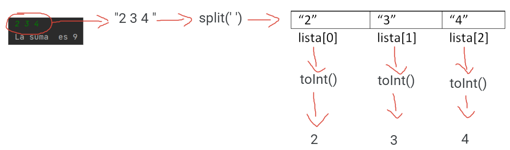

## Las funciones readLine() y readln()
readline() y readln() son funciones que se pueden utilizar para leer líneas del teclado entre otras funciones. La función readln() es de existencia más reciente, aparece a partir de Kotlin 1.6, por tanto, sólo se puede utilizar con  las versiones más recientes de kotlin.  Para programas sencillos e iniciarse es mejor usar readln() que oculta el problema del valor null. Si tienes que trabajar con una versión anterior a 1.6 tendrás consultar los contenidos sobre valor nulo y readLine()

## Qué es una línea y su relación con el teclado.
La funcion readln()  lee una línea de la  entrada estándar.

La entrada estándard por defecto es el teclado. La entrada standard  se puede cambiar de forma que por ejemplo la entrada standar sea un fichero y entonces las líneas se leerían  del fichero en lugar del teclado pero para nosotros de momento la entrada standar siempre será el teclado.

Una línea en programación es un una ristra o cadena de caracteres que termina con el caracter especial \\n (salto de línea)

Para generar desde el teclado un \\n pulsamos enter. Por tanto  generar una línea en el teclado consistirá en teclear una serie de caracteres y pulsar enter.

## readln() devuelve *String*
readln() devuelve una línea del teclado y la devuelve como un  String al programa
```java
fun main() {
    print("teclea una frase y te la repito: ")
    val x: String = readln()
    print(x)
}
```
En el ejemplo anterior indicamos que el tipo de x es String para tener claro que nos devuelve readln(), pero una vez asimilado podemos omitir el tipo y usar la inferencia automática de tipos que hace Kotlin 
```java
fun main() {
    print("teclea una frase y te la repito: ")
    val x = readln()
    print(x)
}
```

## Sistema típico de entrada de datos alternando print() con readln()

```java
fun main() {
    print("Dime tu nombre: ")
    var nombre = readln()
    println("Hola $nombre" )
    print("Bien, ahora dime tus apellidos: ")
    var apellidos=readln()
    println("Por lo tanto tu nombre completo es: "+ nombre+" "+ apellidos)
}
```
## Necesidad de funciones de String para convertir a tipo numérico
*readln()* devuelve un String, pero a menudo el String introducido por teclado queremos convertirlo a otro tipo de dato, por ejemplo a un tipo  numérico para hacer operaciones matemáticas.
En el siguiente ejemplo queremos sumarle 1 a la edad introducida por teclado pero el operador + realmente está trabajando con strings y por tanto concatena, no hace suma aritmética que es lo que queríamos.
```java
fun main() {
    print("Dime tu edad: ")
    var edad = readln()
    edad = edad +1
    println("Dentro de un año tendrás  $edad años" )
}
```
Para obtener el efecto deseado necesitamos convertir el String introducido por teclado en entero y almacenar este valor en una variable entera. Al trabajar con tipos de datos enteros el operador + realizará la suma de enteros.
```java
fun main() {
    print("Dime tu edad: ")
    var edad = readln().toInt()
    edad = edad +1
    println("Dentro de un año tendrás  $edad años" )
}
```
Las funciones para convertir un String en valor de tipo numérico  son:
- toByte()
- toShort()
- toInt()
- toFloat()
- toDouble()
- toLong()
## Entrada de datos sin mensajes print()

Los ejemplos anteriores que cogen datos de teclado siguen el esquema típico de print explicativo seguido de readln(). Pero los print explicativos no son realmente necesarios y de hecho en muchos tipos de problemas para homogeneizar y simplificar la entrada salida se evitan. 
En el siguiente ejemplo se suman dos numeros introducidos por teclado. El usuario simplemente sabe que debe introducir dos números enteros, cada uno en una línea y si lo hace así todo funciona perfectamente
```java 
fun main() {
    var num1 = readln().toInt()
    var num2 = readln().toInt()
    var suma=num1+num2
    println("La suma es: " + suma)
}
```

Por la dinámica del curso interesa simplificar la entrada/salida y por tanto, aunque te resulte chocante,  usaremos más esta segunda forma para introducir datos por teclado que la típica que alterna print() con readln().


### Combinando con split()
Otra situación típica de entrada de datos sin print() consiste en  que queremos poder escribir en la misma línea entradas independientes separadas normalmente por un espacio en blanco. Aplicando al String que devuelve readln la función split(), obtenemos los datos individuales de la línea.


Ejemplo de ejecución, donde la primera línea es la entrada por teclado y la segunda la impresión del programa
```
2 3 4
La suma  es 9

```
El código para Kotlin
```java
fun main() {
    val linea = readln()
    val lista= linea.split(' ')
    var num0=lista[0].toInt()
    var num1=lista[1].toInt()
    var num2=lista[2].toInt()
    var suma=num0+num1+num2
    println("La suma  es $suma")
}
```


