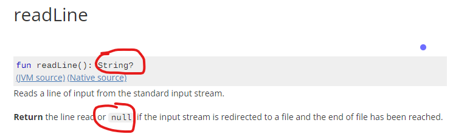

La funcion readLine()  lee una línea de la  entrada estándar.

La entrada estándard por defecto es el teclado. La entrada standard  se puede cambiar de forma que por ejemplo la entrada standar sea un fichero y entonces las líneas se leerían  del fichero en lugar del teclado pero para nosotros de momento la entrada standar siempre será el teclado.

Una línea en programación es un una ristra o cadena de caracteres que termina con el caracter especial \\n (salto de línea)

Para generar desde el teclado un \\n pulsamos enter. Por tanto  generar una línea en el teclado consistirá en teclear una serie de caracteres y pulsar enter.

## readLine() devuelve *String?*
readLine() devuelve una línea del teclado y la devuelve como un  String al programa, pero  además,  readLine() también puede devolver null y por tanto decimos que readLine() devuelve un *String?*

Fíjate como en la documentación oficial de kotlin nos indica que efectivamente esta función devuelve un *String?*



Comprueba esta afirmación observando el error de compilación del siguiente código
```java
fun main() {
    print("teclea una frase y te la repito: ")
    val x: String = readLine()
    print(x)
}
```

El problema es que por defecto en una variable de tipo String no se pueden almacenar nulos pero readLine() podría devolver null. 

Usando como entrada Standard el teclado no se generan nulos pero todo esto rollazo es debido a que readLine() se puede usar con otras entradas, por ejemplo para leer ficheros.
## Usar una variable que permita almacenar null.
Una solución es permitir que x almacene null usando el operador ?
```java
fun main() {
    print("teclea una frase y te la repito: ")
    val x: String? = readLine()
    print(x)
}
```
### ¿Qué pasa si no especificamos el tipo de  una variables inicializada con readLine()?.
Observa que en el  siguiente código no especificamos el tipo de *x* y compila correctamente 
```java
fun main() {
    print("teclea una frase y te la repito: ")
    val x = readLine()
    print(x)
}
```

Para entender porqué compila, simplemente, hay que tener en cuenta que readLine() devuelve algo de tipo *String?* y por tanto kotlin  infiere automáticamente que *x* es del tipo String?, es decir que
```
 val x = readLine()
```
es equivalente a
```
val x: String? = readLine()
```
Esto puedo ser un buen ejemplo de que por un lado cuando no declaramos el tipo de las variables ganamos limpieza y concisión en el código pero en casos como este puede encubrir detalles importantes a tener en cuenta en el resto del código, como no ser conscientes que readLine() no devuelve *String*, realmente devuelve es *String?*

## Indicar con !! que sabemos que no vamos a recibir null
ya que la entrada por teclado no genera nulos, nos podemos librar de declarar tipos con ? usando  el operador !! que como ya vimos al estudiar el valor null, simplemente indica al compilador que no haga el chequeo de posible null.
```java
fun main() {
    print("teclea una frase y te la repito: ")
    val x: String = readLine()!!
    print(x)
}
```

Hay muchas otras formas de afrontar el hecho de que readLine()  devuelve *String?*. Pero por el momento usaremos la más fácil que es usar como en el ejemplo anterior el operador !!


## Sistema típico de entrada de datos alternando print() con readLine()

```java
fun main() {
    print("Dime tu nombre: ")
    var nombre = readLine()!!
    println("Hola $nombre" )
    print("Bien, ahora dime tus apellidos: ")
    var apellidos=readLine()!!
    println("Por lo tanto tu nombre completo es: "+ nombre+" "+ apellidos)
}
```
## Necesidad de funciones de String para convertir a tipo numérico
*readLine()* devuelve un String, pero a menudo el String introducido por teclado queremos convertirlo a otro tipo de dato, por ejemplo a un tipo  numérico para hacer operaciones matemáticas.
En el siguiente ejemplo queremos sumarle 1 a la edad introducida por teclado pero el operador + realmente está trabajando con strings y por tanto concatena, no hace suma aritmética que es lo que queríamos.
```java
fun main() {
    print("Dime tu edad: ")
    var edad = readLine()!!
    edad = edad +1
    println("Dentro de un año tendrás  $edad años" )
}
```
Necesitamos para obtener el efecto deseado convertir el String introducido por teclado en entero y almacenar este valor en una variable entera. Al trabajar con tipos de datos enteros el operador + realizará la suma de enteros.
```java
fun main() {
    print("Dime tu edad: ")
    var edad = readLine()!!.toInt()
    edad = edad +1
    println("Dentro de un año tendrás  $edad años" )
}
```
Las funciones para convertir un String en valor de tipo numérico  son:
- toByte()
- toShort()
- toInt()
- toFloat()
- toDouble()
- toLong()
## Entrada de datos sin mensajes print()

Los ejemplos anteriores que cogen datos de teclado siguen el esquema típico de print explicativo seguido de readLine(). Pero los print explicativos no son realmente necesarios y de hecho en muchos tipos de problemas para homogeneizar y simplificar la entrada salida se evitan. 
En el siguiente ejemplo se suman dos numeros introducidos por teclado. El usuario simplemente sabe que debe introducir dos números enteros, cada uno en una línea y si lo hace así todo funciona perfectamente
```
fun main() {
    var num1 = readLine()!!.toInt()
    var num2 = readLine()!!.toInt()
    var suma=num1+num2
    println("La suma es: " + suma)
}
```

Por la dinámica del curso interesa simplificar la entrada/salida y por tanto, aunque te resulte chocante,  usaremos más esta segunda forma para introducir datos por teclado.

### combinando con split()
Otra situación típica de entrada de datos sin print() es que queremos poder escribir en la misma línea entradas independientes separadas normalmente por un espacio en blanco. Aplicando al String que devuelve readln() la función split() obtenemos los datos individuales de la línea.
Ejemplo
```
fun main() {
    val linea:String = readln()!!
    val lista= linea.split(" ")
    var suma=0
    for( numero  in lista){
        suma=suma+ numero.toInt()
    }
    println("La suma  es $suma")
}
```
Ejemplo de ejecución, donde la primera línea es la entrada por teclado y la segunda la impresión del programa
```
2 3 4
La suma  es 9

```
