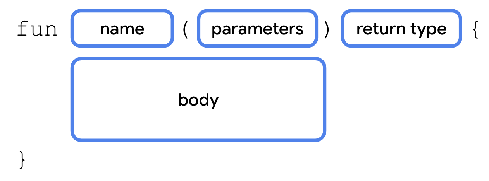
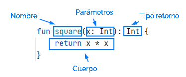
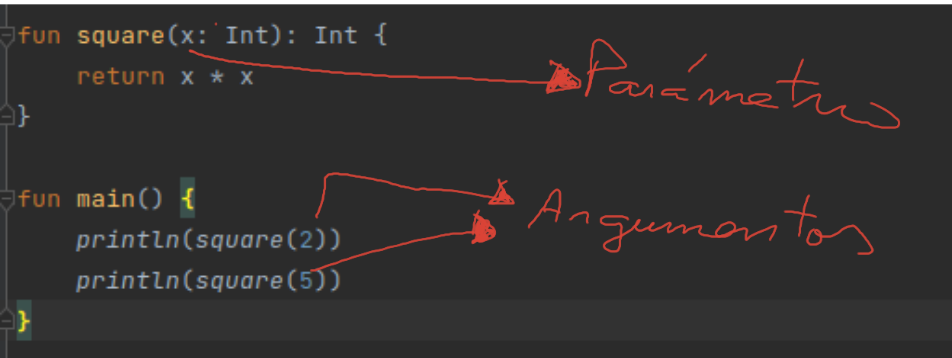
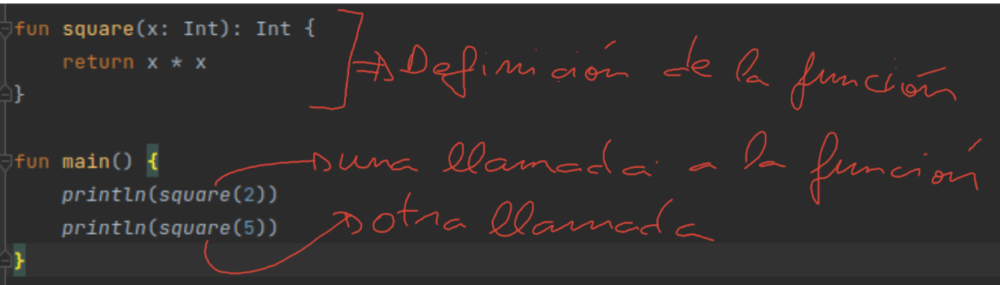

El concepto de función de programación es  parejo al de función matemática, pero incorpora diversos matices para adecuar el concepto  matemático de función al mundo de la programación. 


Ya utilizamos funciones en nuestros ejemplos, por ejemplo la función *print()* que es una función escrita por los fabricantes de kotlin y que nosotros podemos usar cuantas veces queramos. Pero en nuestros ejemplos no sólo estuvimos usando funciones ya hechas como *print()*, también  escribimos el código de una función, concretamente escribimos constantemente el código de la  funcion "especial" *main()* que será una función que llama o invoca el sistema Kotlin para comenzar la ejecución de nuestra  aplicación. 

Una función es un bloque de código que se escribe para realizar una tarea en particular. Se escribe una vez y luego se puede utilizar o llamar las veces que queramos por lo tanto es uno de los mecanismos que tienen los lenguajes de programación para evitar duplicar código.

Para poder disfrutar de una función tendremos que hacer dos cosas: 
- definir la función
- llamar a la función.

## Definición de una función
Una función se debe definir según esta estructura básica. A esta estructura básica iremos añadiendo excepciones.




#### Ejemplo
función que recibe un número entero y devuelve dicho número elevado al cuadrado.

```java
fun square(x: Int): Int {
    return x * x
}
```
#### Por lo tanto para definir una función:
- Comenzamos con la palabra reservada *fun*  
- Nombre de la función − Es el nombre que eliges para la función con el fin de esclarecer su propósito
- Lista de parámetros − . Defínelos como nombre:tipo y sepáralos por comas.
- Tipo de retorno − Tipo de dato de salida de la función.
- Cuerpo de la función – Son todas las sentencias que realizan la tarea para llegar al resultado final de retorno. Usa la expresión return para devolver el valor.





## Llamar a una función
### Parámetros y argumentos
Para entender bien el mecanismos de llamada a una función es necesario tener clara la relación entre el concepto de parámetro y el concepto de argumento, que por cierto, es el mismo que en las matemáticas tradicionales:
- parámetro. Un parámetro no es más que una variable definida entre los paréntesis de la función.
- argumento. Un argumento es un valor que se le pasa a una variable parámetro a través del mecanismo de *llamada a una función*.

En muchos sitios web usan indistintamente estos  dos términos y, además de que no es correcto, puede generarte  confusión y falta de claridad en las explicaciones.



### El mecanismo de llamada a una función
Una vez que tenemos definida una función, podemos llamar o invocar a una función.

LLamar a una función consiste simplemente en  escribir su nombre junto a los valores que queremos que tomen sus parámetros.  Recuerda que a los valores que le pasamos a la función le llamamos *argumentos*. En el siguiente ejemplo, definimos la función, y luego en  main() pasamos a usarla/llamarla/invocarla las veces que queramos, en este caso sólo dos veces pero no hay límite de cantidad de llamadas.





Con un poco más de detalle, lo que ocurre cuando se llama a una función  es:
 1. los argumentos se asignan a los  parámetros
 2. se ejecutan  las instrucciones de su cuerpo que probablemente utilicen los valores recibidos por los parámetros
 3. y finalmente como resultado de su ejecución devolverán casi siempre un valor de retorno.

Así por ejemplo, cuando realizamos la primera llamada square(2) ocurre:
1. Al parámetro x se le asigna el valor "2". Puedes imaginarte que internamente en la función al ser invocada de esa manera ocurre  una instrucción de asignación  tipo *x=2*
2. se hace el cálculo x*x que es 4
3. como esta expresión está despues de la palabra reservada *return*, el valor 4 es lo que finalmente "devuelve" la función. 
   
## Funciones con *Cuerpo De Expresión*
También se les conoce por *funciones de una sóla línea*.

Si el cuerpo de una función es tan sencillo que consiste en devolver simplemente el valor de una expresión podemos escribir la función con una sintaxis más breve. Volvemos a escribir la función square() con esta sintaxis y observamos:
- se escribe en una única línea
- desaparecen  {} y return.
- aparece =

```java
fun square(x: Int): Int =  x * x

fun main() {
    println(square(2))
    println(square(5))
}
```


## Retorno tipo Unit
Toda función tiene que tener un tipo de retorno. Si una función no devuelve ningún valor su  tipo de retorno es  *Unit* que es un tipo de retorno especial que justamente indica que la función no devuelve nada.
```java
fun saludar(nombre: String): Unit {
    println("Hola, " + nombre)
}
fun main() {
   saludar("Winchi")
}
```
### El tipo de retorno Unit se puede omitir
si en la definición de la función omitimos el tipo de retorno se asume que su tipo es *unit*. 

¿Cuál es el tipo de la famosa función main()? Observarás que no se especifica, por tanto su  tipo de retorno es *Unit*. En el siguiente ejemplo no se especifica el tipo para saludar() y por tanto sabemos que su tipo es Unit, es decir, que no devuelve ningún valor

```java
fun saludar(nombre: String){
    println("Hola, " + nombre)
}
fun main() {
   saludar("Winchi")
}
```
### Unit y return
Cuando una función es de tipo Unit, es decir,  no devuelve ningún valor , podemos omitir el return cuando dicho return es la última instrucción de la función. En el siguiente ejemplo añadimos el return a saludar() y vemos que el efecto es el mismo que no ponerlo.

```java
fun saludar(nombre: String): Unit {
   println("Hola, " + nombre)
   return
}
fun main() {
   saludar("Winchi")
}
```
Pero veremos más adelante, que una función no tiene porque tener un único return colocado como última instrucción, así que, lo indicado anteriormente tendrá matices que veremos en su momento.
## Parametros con valores por defecto
Al definir la función es posible indicar los valores por defecto de los parámetros. Por el momento para simplificar, nos fijamos en el funcionamiento de este mecanismo cuando la función consta de sólo un parámetro.
```java
fun saludar(nombre: String="Churry"){
    println("Hola, " + nombre)
}
fun main() {
    saludar("Winchi")
    saludar()
}
```

## ¿Porqué usar funciones?
La incorporación de las funciones en la programación fue un gran avance, algunas razones:
- Se pueden ejecutar más de una vez en un programa y/o en diferentes programas ahorrando tiempo de programación.
- Es una forma de compartir código entre programadores.
- Es una forma de dividir un problema complejo en problemas simples. cada problema simple sería una función. Esto además facilita la división de tareas entre un equipo de programadores.
- Mejora la estructura y legibilidad de un programa.
- Se pueden probar individualmente y por tanto facilita el mantenimiento del programa.
- Son la base del paradigma  de programación funcional  que veremos más adelante en el curso.
  

## Variables locales y globales.
- variable local: variable que se define dentro de una función
- variable global: variable que se declara al principio del programa (al principio del fichero) fuera de toda función.
  
En el siguiente ejemplo x es una variable global al programa de forma que es accesible desde todas las funciones del fichero, en este caso fn() y main().  
  
```java
 
var x = 100 // variable global

fun fn() {
   x = x + 100
}

fun main() {
   println("x vale : $x")
   fn()
   println("x vale: $x")
}
```
A lo largo del curso, iremos entendiendo que, salvo en casos especiales, debe evitarse el uso de variables globales ya que generan código inseguro de mala calidad.
## variables locales y funciones
Todas las variables que se declaran en una función son locales a esa función, esto incluye:
- los parámetros, que no son más que un tipo de variables locales que toman su primer valor cuando se invoca a la función con argumentos.
- las variables que se declaran en el cuerpo de la función.

Una variable local sólo es accesible desde la función que la declara. En el siguiente ejemplo observa que la variable x sólo es accesible desde fn() y la variable y desde main(). Si descomentas las instrucciones comentadas observarás el error.
``` java
fun fn() {
   var x = 100
   println(x)
   //println(y) //error,  y no es una variable conocidad dentro de fn
}

fun main() {
   var y =10
   println(y)
   //println(x) //error, x no es una variable conocida dentro de main
}
```
Esta idea es extensible a los parámtros con la salvedad de la asignación entre parámetro y argumento. Observa el error  si descomentamos en main() la instrucción comentada
```java


fun fn(x:Int) {
   println(x)
   //println(y) //error y no es una variable conocidad dentro de fn
}

fun main() {
   var y =10
   fn(7)
   println(y)
   //println(x) //error, x no es una variable conocida dentro de main
}
```
Por lo tanto,  funciones diferentes pueden tener una variable con el mismo nombre, no hay lugar a la confusión ya que realmente son  variables diferentes sólo accesibles desde su función.
```java
fun fn1(x:Int) {
   println(x)
}
fun fn2(x:Int) {
   println(x)
}
fun fn3() {
   var x=3
   println(x)
}
fun main() {
   fn1(1)
   fn1(2)
   fn1(3)
}
```

##  variables locales y bloques anidados
Llamemos bloque de instrucciones al conjunto de instrucciones definido entre {}. En el siguiente ejemplo observamos que el bloque del cuerpo del while está anidado dentro del bloque de la función main()
```java 
fun main() {
   var x=20
   while(x<20){
      x++ //puedo usar una variable declarada en un bloque más externo
      var y= 56
   }
   //println(y) no se puede usar una variable declarada en un bucle interno
}

```
Evita usar variables en bloque externo e interno con el mismo nombre. Es posible pero confuso.  En el siguiente ejemplo observamos que la variable x del bloque if oculta a la del bloque externo
```java
fun main() {
   var x=20
   if(x<100){
      var x=8
      println(x)
   }
   println(x)
}
```
Algo que si se utiliza mucho es repetir el mismo nombre para las variables contador de los bucles **cuando estos son secuenciales (sin anidar)**. Así evitamos que tener que estar inventando nombres. En el siguiente ejemplo llamamos siempre i a los contadores pero son variables que se crean y destruyen con cada for y no surgen problemas.
```java
fun main() {
   for(i in 1..3) println("Hola mundo")
   for(i in 1..3) println("Adios mundo")
}
```
