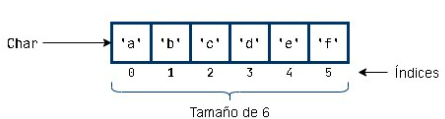

Un array es un conjunto de valores del mismo tipo y permite acceder a ellos a través de una sola variable. Por ejemplo si tengo que almacenar 100 números enteros en lugar de crear 100 variables individuales puedo gestionar esos 100 valores enteros de forma simple y uniforme con un array de enteros a través de una única variable.

Otras cuestiones que caracterizan a un array son:
-  es una estructura de tamaño fijo, una vez que se crea no se puede modifica su tamaño.
-  sus elementos se almacenan de forma contigua.
-  a cada elemento se le asocia un índice correspondiente a su posición teniendo en cuenta que la primera posición se corresponde con el índice 0.

Por ejemplo, esto sería la visión gráfica de un array de 6 elementos de tipo Char


La potencia de objetos como el array se entenderá cuando estudiemos estructuras de control. Vemos en este documentos sólo algunas de las cuestiones básicas del manejo de arrays

## Crear un Array 
Hay varias formas de crear una array, para simplificar,  por el momento nos limitamos a crear un array de dos formas:
- con  arrayOf()
- con arrayOfNulls() 

### Crear un array con arrayOf()
Simplemente separamos por comas una lista de los elementos que va a almacenar el array. Recuerda que todos los elementos tienen que ser del mismo tipo.  El tamaño del array se deduce automáticamente del tamaño de la lista indicada.

```java
val nombres= arrayOf("yo","tú","el")//array de strings
val impares= arrayOf(1,3,5)//array de enteros
```
### Crear una array con arrayOfNulls()
 Puede ocurrir que al principio del programa no sepamos los valores del array ya que por ejemplo se quieren introducir los valores por teclado, en este caso, podemos crear el array de forma que contenga sus elementos inicializados al valor null. Basta en este caso simplemente indicar el tamaño deseado y el tipo de los elementos. 
 ```
  val impares= arrayOfNulls<Int>(3)
 ```

## Tamaño de un array
Ya indicamos que el tamaño o longitud del array se determina en el momento de su creación.Podemos consultar el tamaño de un array a través de la propiedad *size*
```java
fun main() {
    val nombres= arrayOf("yo","tú","el")
    val impares= arrayOf(1,3,5,7)
    println("tamaño de array nombres:" + nombres.size)
    println("tamaño de array impares:" + impares.size)
}
```
## Acceder a un elemento del array

Los arrays son accesibles con un sistema de índices similar al que vimos con los Strings de forma que  el primer elemento se corresponde con el índice  0, el segundo con el 1, etc.  Al igual que con los Strings el acceso a los elementos del array se realiza indicando el índice entre corchetes.
Por ejemplo, comprobamos que efectivamente con arrayOfNulls inicializamos a Null y a continuación cambiamos de valor los elementos del array

```java
fun main() {
    val impares= arrayOfNulls<Int>(3)
    println(impares[0])
    println(impares[1])
    println(impares[2])

    impares[0]=55
    impares[1]=99
    impares[2]=33

    println(impares[0])
    println(impares[1])
    println(impares[2])

}
```
Los arrays tienen un gran número de cuestiones que tratar, no obstante, ya que esto es un curso introductorio preferimos por diversas razones utilizar listas en lugar de arrays. A continuación estudiaremos el concepto de lista en Kotlin.
